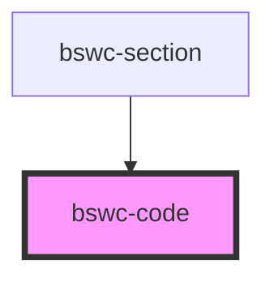

# bswc-code

<!-- Auto Generated Below -->

## Properties

| Property        | Attribute        | Description | Type      | Default     |
| --------------- | ---------------- | ----------- | --------- | ----------- |
| `insideSection` | `inside-section` |             | `boolean` | `undefined` |
| `language`      | `language`       |             | `string`  | `undefined` |

## Dependencies

### Used by

 - [bswc-section](../section)

### Graph

----------------------------------------------

*Built with [StencilJS](https://stenciljs.com/)*
