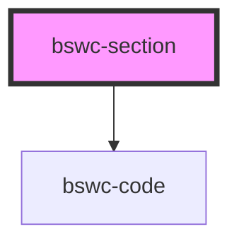

# bswc-section

<!-- Auto Generated Below -->

## Properties

| Property  | Attribute | Description | Type     | Default     |
| --------- | --------- | ----------- | -------- | ----------- |
| `heading` | `heading` |             | `string` | `undefined` |
| `slug`    | `slug`    |             | `string` | `undefined` |

## Dependencies

### Depends on

- [bswc-code](../code)

### Graph

----------------------------------------------

*Built with [StencilJS](https://stenciljs.com/)*
